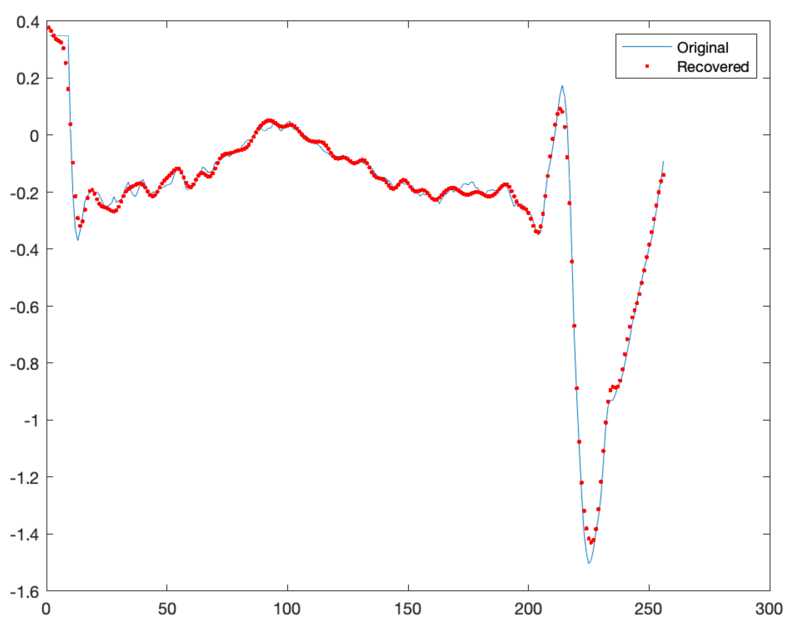

# Data Compression using Discrete Cosine Transform in TelosB Mote/Cooja
In this assignment, data compression using discrete cosine transform (DCT) will be studied for the time-series signals. For testing electrocardiogram (ECG) signals will be used. DCT-II transform of a length N signal x is given as,

For further details, see project proposal [WSNAssignment2-DCT.pdf](WSNAssignment2-DCT.pdf)

# Goal
The goal of this assignment is to implement DCT transform in the TelosB mote in an energy-efficient way for time series data.
Tasks to be completed are:
- Implement and measure the execution time and energy consumption for the following cases:
  - N = 256 and M = 75.
  - N = 512 and M = 120.
- Measure the mean square error between the original signal and reconstructed signal for both the cases.

# Results N = 256 and M = 75
Execution time: 
- 2659 seconds
- 2659/60 = 44.3267 minutes 

Mean square error between the original signal and reconstructed signal:
- 0.155425

Plot comparison from original signal to recovered:

  

# Results N = 512 and M = 120
Execution time: 
-  14950 seconds
-  14950/60 = 249.167 minutes
-  249.167/60 = 4.152 hours

Mean square error between the original signal and reconstructed signal:
- 0.119003

Energy consumption:
- 
                                         
Plot comparison from original signal to recovered:

  

